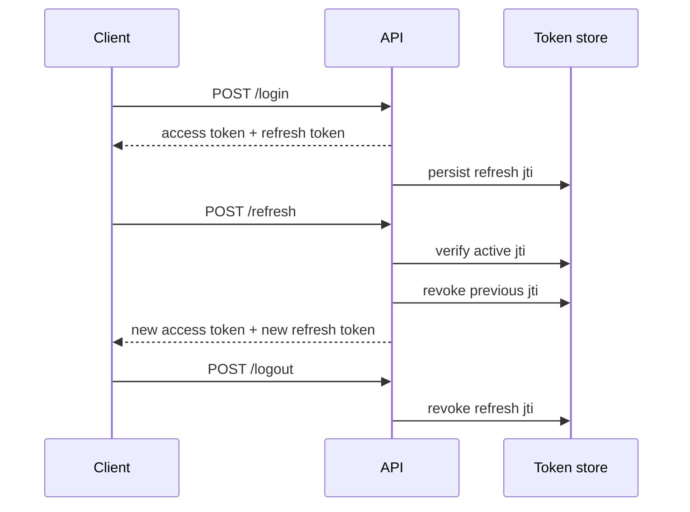

# JWT Authentication Service with Fastify

A compact authentication service built with **Fastify** and **TypeScript** to explore JWT lifecycle management beyond the basic “sign in and verify a token” flow.

The project focuses on access/refresh token separation, refresh-token rotation, logout revocation, password-change invalidation, role-based authorization and timestamp-based session revocation.

> This repository intentionally uses an in-memory data store so the authentication and token-lifecycle logic stays easy to inspect. It is a technical demonstration, not a drop-in production identity provider.

## What it demonstrates

- Short-lived **access tokens** and longer-lived **refresh tokens**
- Refresh-token persistence with `jti` identifiers
- **Refresh-token rotation** to prevent token reuse
- Logout through explicit refresh-token revocation
- Session invalidation after a password change
- Revocation of sessions issued before a chosen timestamp
- Role-based authorization for privileged operations
- Password hashing using Node.js `scrypt`
- End-to-end API tests using Fastify's in-process `inject()` API
- Automated lint, typecheck, test and build checks with GitHub Actions

## Token lifecycle



## API

| Method | Endpoint | Purpose |
| --- | --- | --- |
| `POST` | `/login` | Authenticate and create an access/refresh token pair |
| `POST` | `/refresh` | Rotate a valid refresh token and issue a new token pair |
| `POST` | `/logout` | Revoke a refresh token |
| `POST` | `/change-password` | Change the current password and invalidate existing sessions |
| `POST` | `/revoke-before` | Revoke sessions issued before a timestamp |
| `GET` | `/sessions` | Return the current number of active refresh sessions |
| `GET` | `/me` | Return the authenticated user |
| `GET` | `/protected` | Example protected resource |
| `POST` | `/change-role` | Admin-only role update; invalidates the target user's sessions |

## Security decisions

### Access and refresh tokens have different responsibilities

Access tokens are short-lived and used to authorize API requests. Refresh tokens are longer-lived and tracked server-side by `jti`, allowing the service to revoke or rotate them independently.

### Refresh tokens are rotated

A successful refresh invalidates the token that was just used and returns a new refresh token. Attempting to reuse the previous token returns `401`.

### Sensitive account changes invalidate sessions

Changing a password or role records a revocation boundary and removes active refresh tokens for the affected user, so previously issued credentials cannot continue to create new sessions.

### Passwords are not stored in plaintext

The mock store keeps salted `scrypt` digests rather than raw passwords. A real application would move identity data and token state into a persistent database and normally use a dedicated password-hashing configuration such as Argon2id or carefully tuned scrypt.

## Project structure

```text
src/
├── auth/
│   ├── guard.ts          # Access-token authentication and revocation checks
│   └── tokens.ts         # Token issuing, rotation and revocation helpers
├── db/
│   └── mockDB.ts         # In-memory users and refresh-token records
├── routes/
│   ├── auth.ts           # Login, refresh, logout and session lifecycle routes
│   └── users.ts          # Protected user and role routes
├── security/
│   └── password.ts       # Password hashing and verification
├── types/
│   └── fastify-jwt.d.ts  # @fastify/jwt type augmentation
├── server.ts             # Application composition
└── start.ts              # Runtime entry point
```

## Getting started

Requires Node.js 22+.

```bash
npm install
```

Set a long random value for `JWT_SECRET`, then run:

```bash
JWT_SECRET="replace-with-a-long-random-secret" npm run dev
```

The API listens on `http://localhost:3000` by default.

## Quality checks

```bash
npm run lint
npm run typecheck
npm test
npm run build
```

The same checks run in GitHub Actions for pull requests and pushes to `main`.

## Test coverage

The end-to-end suite covers:

- successful login and protected access
- invalid credentials
- refresh-token rotation and reuse rejection
- logout revocation
- password changes and session invalidation
- timestamp-based revocation
- authorization of role changes
- invalidation of stale sessions after a role update

## Production considerations

To evolve this demo into a production-oriented service, the next steps would include:

- persistent users and refresh-token storage (for example PostgreSQL)
- transactional refresh-token rotation
- rate limiting and login throttling
- account lockout / abuse controls
- stricter request schemas and centralized error handling
- secret management outside local environment files
- HTTPS-only secure cookie transport where appropriate
- token-family reuse detection and audit logging

## Why this project exists

I built this project as a focused exercise in authentication state and revocation semantics. The interesting part is not generating a JWT; it is deciding what should happen to already-issued credentials when users log out, rotate tokens, change passwords or change authorization level.
